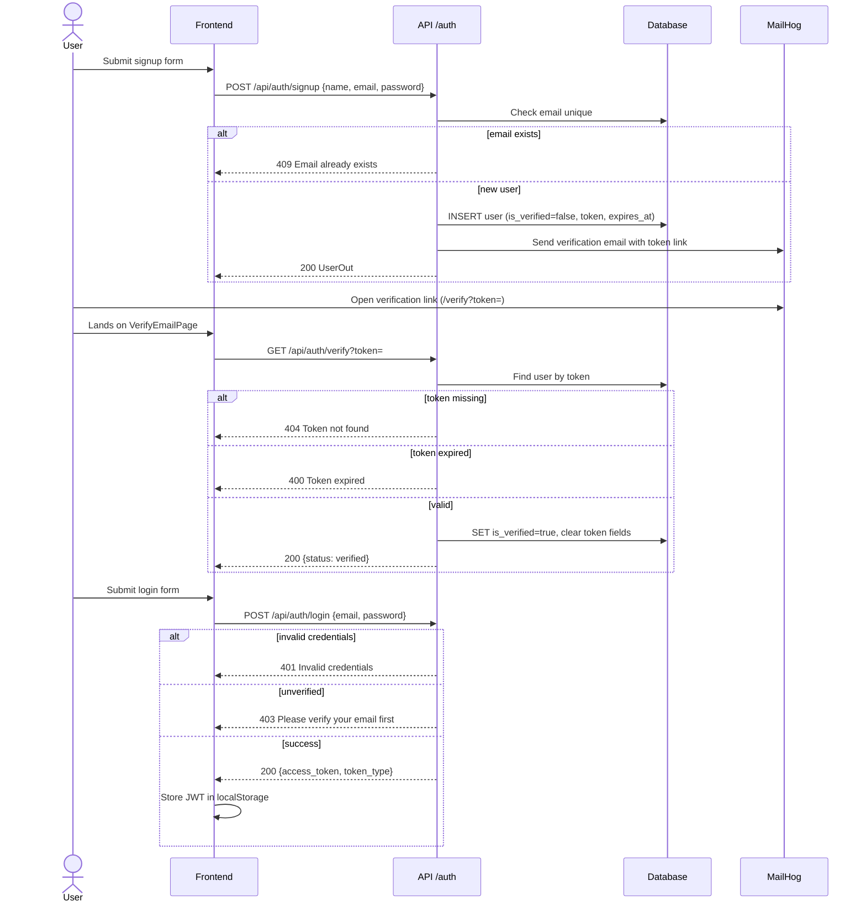
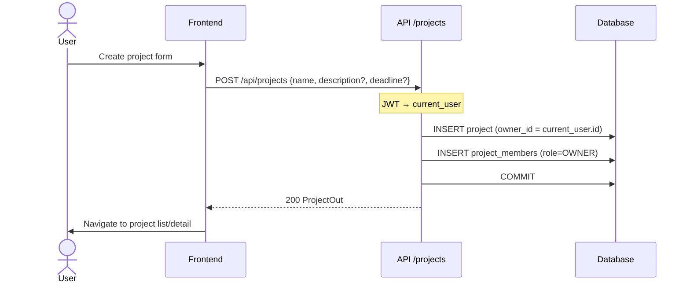
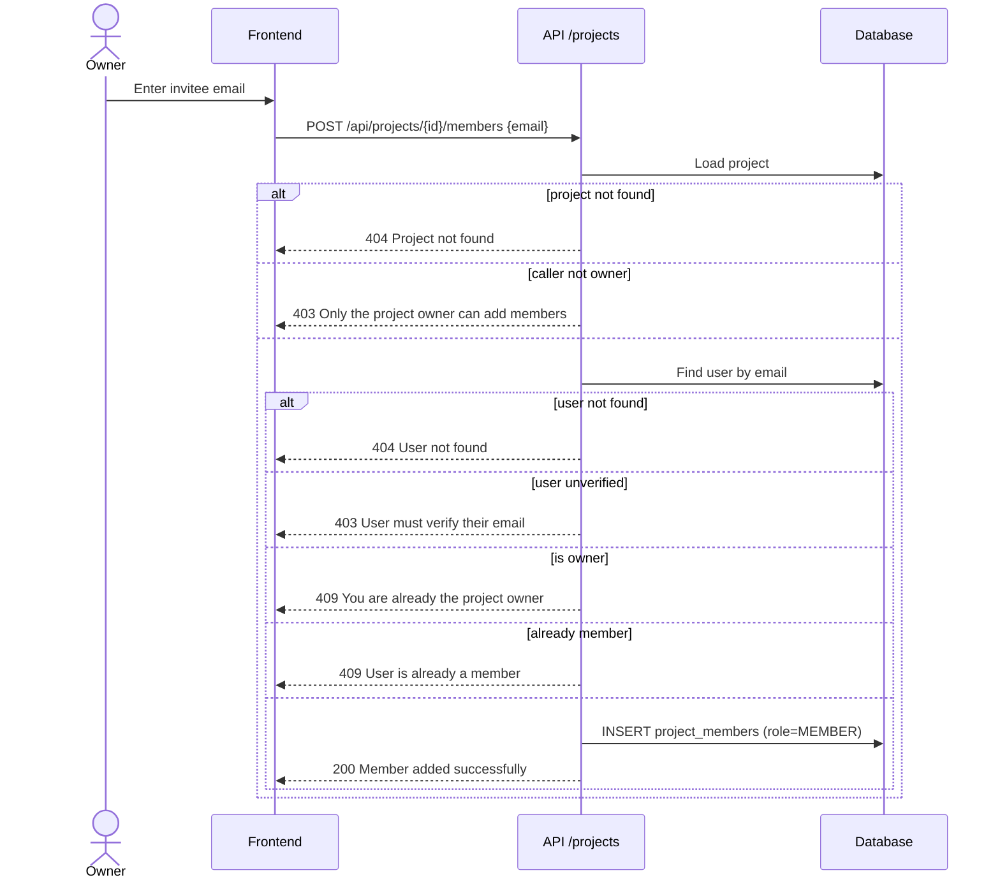
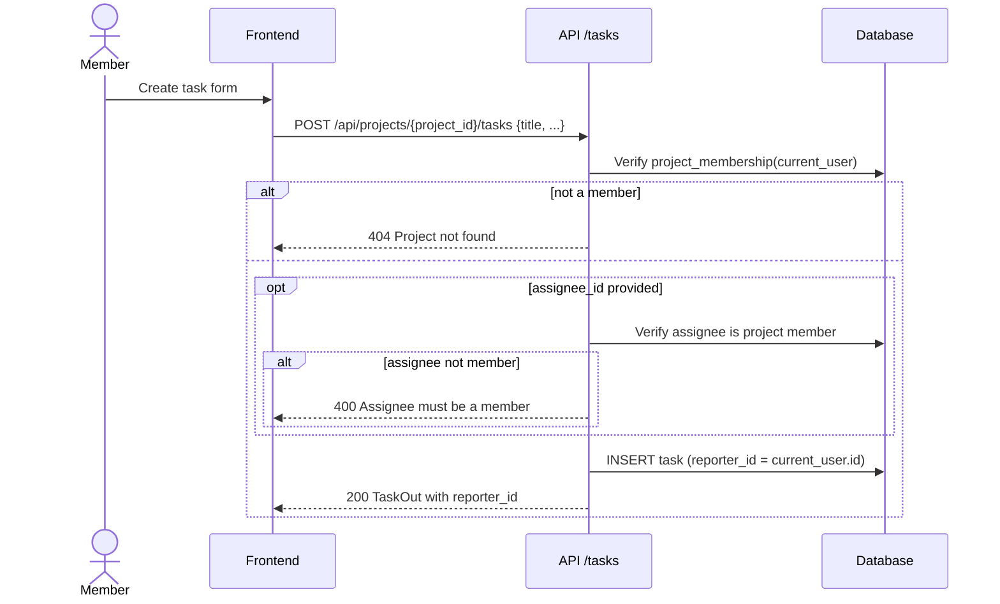
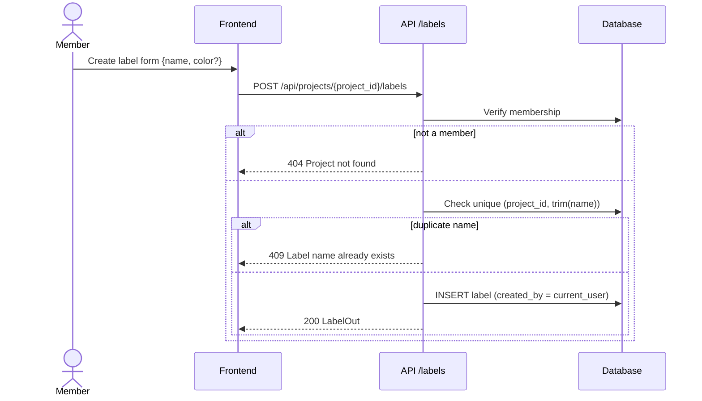
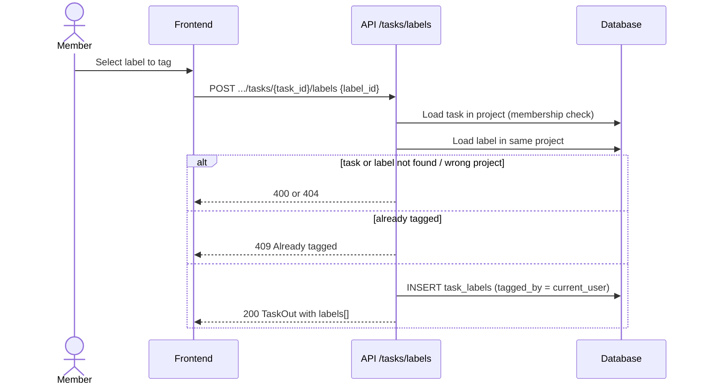
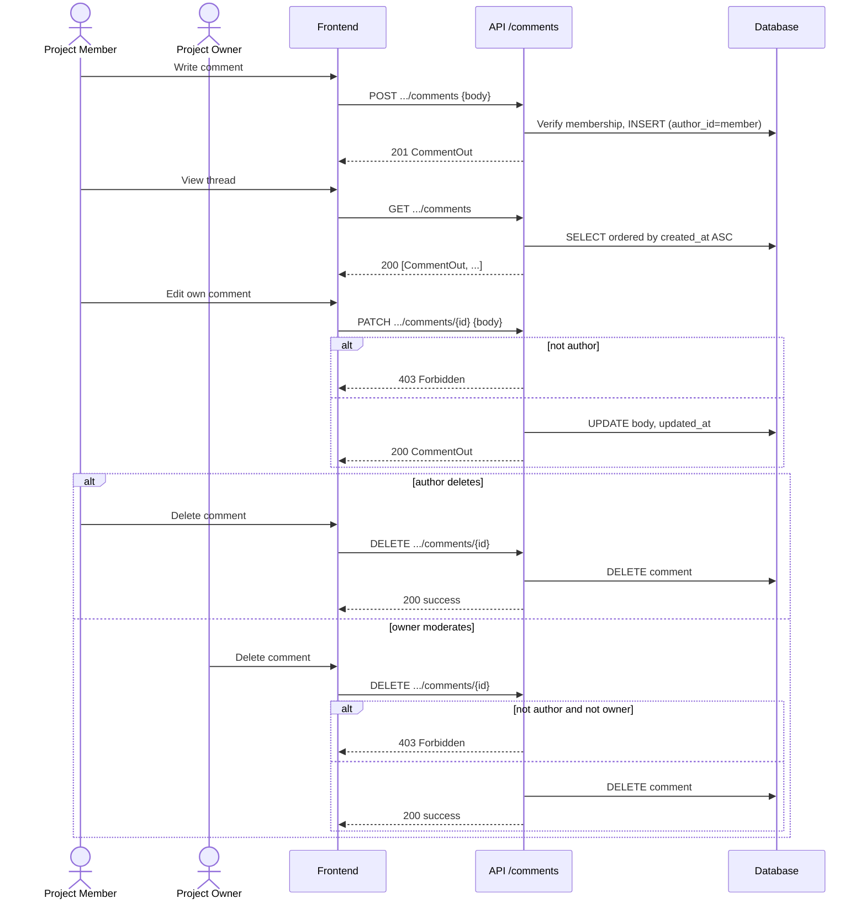
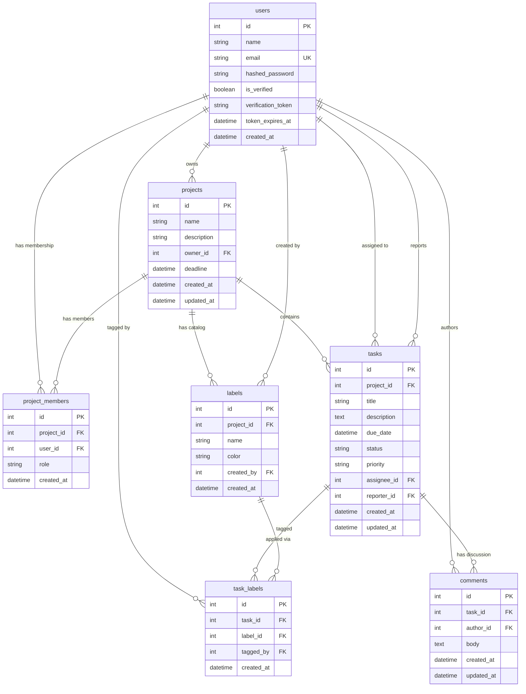
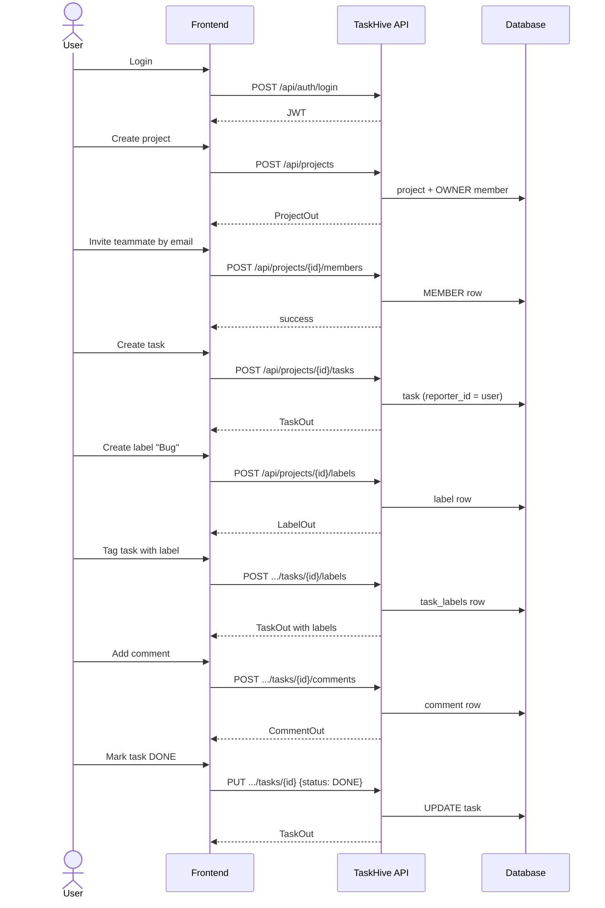

# TaskHive — Project Requirements

TaskHive is a collaborative project-management application. Users register, verify their email, create projects, invite members, and manage tasks. This document is the single source of truth for business rules, API contracts, database schema, and key user flows.

---

## Shared conventions

| Convention | Detail |
|---|---|
| Authentication | JWT via `Authorization: Bearer <access_token>` on protected routes |
| Hidden resources | Non-members receive **404** (not 403) for projects/tasks they cannot access |
| Owner-only actions | Member-management endpoints return **403**; current project update/delete endpoints hide ownership failures with **404** |
| Unique conflicts | **409** (duplicate email, duplicate label name, already tagged, etc.) |
| Validation errors | **422** (Pydantic field validation) |
| Password hashing | Argon2 |
| API prefix | Application routes use `/api`; the health check is `GET /health` |

---

## Document structure

- **Part 1** — Already implemented (backend + partial frontend)
- **Part 2** — New requirements (models added; label/comment APIs documented for later implementation)

Each module follows: **Description → Business requirements → Technical mapping → Sequence diagram(s)**

---

# Part 1 — Already implemented

---

## Module 1 — Authentication

### Description

Account registration, email verification, login, and JWT sessions. Unverified users cannot log in or be added to projects.

### Business requirements

- Anyone can sign up with name, unique email, and password (min 8 chars, at least 1 letter and 1 digit).
- Signup creates an unverified user and emails a time-limited verification token. The link targets `/verify` on the frontend with `?token=`.
- User must verify before login. Expired tokens can be replaced via resend.
- Login returns a JWT. Logout is client-side only (no server revoke endpoint).
- Duplicate email is rejected. Invalid credentials do not reveal whether the email exists.

### Technical mapping

**Table: `users`**

| Column | Type | Notes |
|---|---|---|
| `id` | Integer PK | |
| `name` | String(255) | |
| `email` | String(255) | Unique, indexed |
| `hashed_password` | String(255) | Argon2 |
| `is_verified` | Boolean | Default `false` |
| `verification_token` | String | Nullable; cleared on verify |
| `token_expires_at` | DateTime(tz) | Nullable |
| `created_at` | DateTime(tz) | Auto-set |

**APIs**

#### `POST /api/auth/signup`

| | |
|---|---|
| Auth | None |
| Body | `{ "name": string, "email": string, "password": string }` |
| Success **200** | `UserOut`: `{ "id", "name", "email", "is_verified" }` |
| Errors | **409** email exists · **422** validation |

Sends verification email via MailHog in development.

#### `GET /api/auth/verify?token=<token>`

| | |
|---|---|
| Auth | None |
| Success **200** | `{ "status": "verified" }` |
| Errors | **404** unknown token · **400** expired token |

#### `POST /api/auth/resend-verification`

| | |
|---|---|
| Auth | None |
| Body | `{ "email": string }` |
| Success **200** | `{ "status": "new token sent" }` |
| Errors | **404** unknown email · **409** already verified |

#### `POST /api/auth/login`

| | |
|---|---|
| Auth | None |
| Body | `{ "email": string, "password": string }` |
| Success **200** | `{ "access_token": string, "token_type": "bearer" }` |
| Errors | **401** invalid credentials · **403** unverified email |

**Frontend coverage:** Signup, login, and verify pages exist. JWT stored in `localStorage` as `access_token`. Axios client injects Bearer token automatically.

### Sequence diagram — signup and verify



---

## Module 2 — Users

### Description

Authenticated profile and discovery of other verified users (used when inviting project members).

### Business requirements

- A logged-in user can view their own profile.
- A logged-in user can list other verified users (excluding themselves and unverified accounts).

### Technical mapping

#### `GET /api/users/me`

| | |
|---|---|
| Auth | Bearer JWT required |
| Success **200** | `{ "id", "name", "email", "is_verified" }` |
| Errors | **401** missing/invalid token |

#### `GET /api/users/`

| | |
|---|---|
| Auth | Bearer JWT required |
| Success **200** | `[{ "id", "name", "email" }, ...]` — other verified users only |
| Errors | **401** |

**Frontend coverage:** Profile data consumed via `AuthContext` after login. User list used indirectly when inviting members on project detail page.

---

## Module 3 — Projects

### Description

A project is the workspace that owns members, tasks, and (future) labels. Every project has one owner.

### Business requirements

- Verified users can create a project (name required; description and deadline optional). Creator becomes **OWNER** automatically via a `project_members` row.
- Users only see projects they belong to.
- Only the owner can update name/description/deadline or delete the project.
- Deleting a project cascades memberships, tasks, labels, comments, and task-label joins.

### Technical mapping

**Table: `projects`**

| Column | Type | Notes |
|---|---|---|
| `id` | Integer PK | Indexed |
| `name` | String(255) | Required |
| `description` | String(255) | Optional |
| `owner_id` | Integer FK → users | |
| `deadline` | DateTime(tz) | Optional |
| `created_at` | DateTime(tz) | Auto-set |
| `updated_at` | DateTime(tz) | Auto-set on create/update |

**APIs**

#### `POST /api/projects`

| | |
|---|---|
| Auth | Bearer JWT |
| Body | `{ "name": string, "description"?: string, "deadline"?: datetime }` |
| Success **200** | `ProjectOut`: `{ "id", "name", "description", "owner_id", "deadline", "created_at" }` |
| Side effect | Inserts OWNER membership for creator |

#### `GET /api/projects`

| | |
|---|---|
| Auth | Bearer JWT |
| Success **200** | `[ProjectOut, ...]` — projects where caller is a member |

#### `GET /api/projects/{project_id}`

| | |
|---|---|
| Auth | Bearer JWT |
| Success **200** | `ProjectDetailOut`: project fields + `members: [{ "id", "user_id", "name", "email", "role" }]` |
| Errors | **404** if caller is not a member |

#### `PATCH /api/projects/{project_id}`

| | |
|---|---|
| Auth | Bearer JWT (owner only) |
| Body | Partial `{ "name"?, "description"?, "deadline"? }` |
| Success **200** | Updated `ProjectOut` |
| Errors | **404** if not owner |

#### `DELETE /api/projects/{project_id}`

| | |
|---|---|
| Auth | Bearer JWT (owner only) |
| Success **200** | `{ "message": "Project deleted successfully." }` |
| Errors | **404** if not owner |

**Frontend coverage:** List, create, detail, update, and delete pages exist under `/projects`.

### Sequence diagram — create project



---

## Module 4 — Project members

### Description

Collaboration roster. Roles are `OWNER` or `MEMBER`. Unique constraint on `(project_id, user_id)`.

### Business requirements

- Only the owner can add a member by email. Invitee must exist, be verified, not already a member, and not be the owner.
- Only the owner can remove a member. The owner cannot be removed.
- Members can view the project and manage tasks; they cannot edit/delete the project or manage the roster.

### Technical mapping

**Table: `project_members`**

| Column | Type | Notes |
|---|---|---|
| `id` | Integer PK | |
| `project_id` | Integer FK → projects | CASCADE on project delete |
| `user_id` | Integer FK → users | |
| `role` | String(255) | `OWNER` or `MEMBER` |
| `created_at` | DateTime(tz) | Auto-set |

Unique: `(project_id, user_id)`

**APIs**

#### `POST /api/projects/{project_id}/members`

| | |
|---|---|
| Auth | Bearer JWT (owner only) |
| Body | `{ "email": string }` |
| Success **200** | `{ "message", "user_id", "project_id", "role" }` |
| Errors | **403** not owner / invitee unverified · **404** project or user · **409** already member or is owner |

#### `DELETE /api/projects/{project_id}/members/{user_id}`

| | |
|---|---|
| Auth | Bearer JWT (owner only) |
| Success **200** | `{ "message": "Member removed successfully." }` |
| Errors | **403** not owner · **404** project or not a member · **400** attempting to remove OWNER |

**Frontend coverage:** Invite and remove member UI on project detail page.

### Sequence diagram — invite member



---

## Module 5 — Tasks (existing + reporter)

### Description

Work items inside a project. **Assignee** is who will do the work. **Reporter** is who created the task (always set by the server).

### Business requirements (implemented)

- Any project member can create, list, update, and delete tasks in that project.
- Title required. Status: `TODO` | `IN_PROGRESS` | `DONE` (default `TODO`). Priority: `LOW` | `MEDIUM` | `HIGH` (default `MEDIUM`).
- Assignee is optional but must already be a project member.
- List can filter by status/priority and sort by `due_date`, `created_at`, `priority`, `status`, `title`.
- Non-members receive **404** (project not found), not **403**.

### Business requirements (new — partially implemented)

- Every task stores `reporter_id` = authenticated creator. Client cannot set or change reporter. **Implemented.**
- Description allows long text (`Text` column, not 255 chars). **Model/migration done; schema max_length still 255 until UI update.**
- Track `updated_at` on changes. **Column added; set automatically on ORM update.**
- **Get one task** endpoint for UI to load labels + comments — documented below, not yet built.
- List filters for `assignee_id`, `reporter_id`, `label_id` — documented below, not yet built.
- Task responses include `reporter_id` and (once tagging exists) nested `labels[]`. **`reporter_id` implemented.**

### Technical mapping

**Table: `tasks`**

| Column | Type | Notes |
|---|---|---|
| `id` | Integer PK | |
| `project_id` | Integer FK → projects | CASCADE, indexed |
| `title` | String(255) | Required |
| `description` | Text | Optional, long text |
| `due_date` | DateTime(tz) | Optional |
| `status` | String(20) | `TODO`, `IN_PROGRESS`, `DONE` |
| `priority` | String(20) | `LOW`, `MEDIUM`, `HIGH` |
| `assignee_id` | Integer FK → users | SET NULL on user delete |
| `reporter_id` | Integer FK → users | RESTRICT, NOT NULL |
| `created_at` | DateTime(tz) | Auto-set |
| `updated_at` | DateTime(tz) | Auto-set on create/update |

**APIs (implemented)**

#### `POST /api/projects/{project_id}/tasks`

| | |
|---|---|
| Auth | Bearer JWT (member) |
| Body | `{ "title", "description"?, "status"?, "priority"?, "due_date"?, "assignee_id"? }` |
| Success **200** | `TaskOut` including `reporter_id` |
| Server sets | `reporter_id = current_user.id` |
| Errors | **404** not a member · **400** assignee not a member · **422** validation |

#### `GET /api/projects/{project_id}/tasks`

| | |
|---|---|
| Auth | Bearer JWT (member) |
| Query | `status`, `priority`, `sort` (`due_date` \| `created_at` \| `priority` \| `status` \| `title`) |
| Success **200** | `[TaskOut, ...]` default sort: `created_at` desc; `due_date` sort puts nulls last |
| Errors | **404** not a member |

#### `PUT /api/projects/{project_id}/tasks/{task_id}`

| | |
|---|---|
| Auth | Bearer JWT (member) |
| Body | Partial update of title/description/status/priority/due_date/assignee_id (not reporter) |
| Success **200** | Updated `TaskOut` |
| Errors | **404** not a member or task not found · **400** assignee not a member |

#### `DELETE /api/projects/{project_id}/tasks/{task_id}`

| | |
|---|---|
| Auth | Bearer JWT (member) |
| Success **200** | `{ "message": "Task deleted successfully." }` |
| Cascade | Deletes comments and task_labels rows |

**`TaskOut` (current)**

```json
{
  "id": 1,
  "project_id": 1,
  "title": "Fix login bug",
  "description": null,
  "status": "TODO",
  "priority": "MEDIUM",
  "due_date": null,
  "assignee_id": null,
  "reporter_id": 2,
  "created_at": "2026-08-20T00:00:00Z",
  "updated_at": "2026-08-20T00:00:00Z"
}
```

**API (planned — not yet built)**

#### `GET /api/projects/{project_id}/tasks/{task_id}`

| | |
|---|---|
| Auth | Bearer JWT (member) |
| Success **200** | Full `TaskOut` + `labels: [{ "id", "name", "color" }]` |
| Errors | **404** missing task or not a member |

**Extended list query params (planned):** `assignee_id`, `reporter_id`, `label_id`

**Frontend coverage:** No task UI yet. Backend CRUD is complete except get-one and extended filters.

### Sequence diagram — create task with reporter



---

# Part 2 — New requirements

Models and migrations for labels, task-label joins, and comments exist. Router endpoints below are **documented only** — implement in a future pass.

---

## Module 6 — Labels

### Description

Per-project catalog of reusable tags (e.g. Bug, Urgent, Frontend). Members create labels once, then attach them to many tasks.

### Business requirements

- Labels belong to a project, not to a user and not globally.
- Any project member can create, list, rename, recolor, and delete labels.
- Name unique per project (trim whitespace, min length 1, max 50).
- Color is a hex string for UI chips (default `#6B7280`).
- `created_by` is the user who created the label.
- Deleting a label removes all task tags for that label; it does not delete tasks.
- Non-members cannot see another project's labels (**404**).

### Technical mapping

**Table: `labels`**

| Column | Type | Notes |
|---|---|---|
| `id` | Integer PK | |
| `project_id` | Integer FK → projects | CASCADE |
| `name` | String(50) | Unique per project |
| `color` | String(7) | Hex, default `#6B7280` |
| `created_by` | Integer FK → users | RESTRICT |
| `created_at` | DateTime(tz) | Auto-set |

Unique: `(project_id, name)`

**APIs (planned)**

#### `POST /api/projects/{project_id}/labels`

| | |
|---|---|
| Auth | Bearer JWT (member) |
| Body | `{ "name": string, "color"?: string }` |
| Success **200** | `{ "id", "project_id", "name", "color", "created_by", "created_at" }` |
| Errors | **404** not a member · **409** duplicate name · **422** validation |

#### `GET /api/projects/{project_id}/labels`

| | |
|---|---|
| Auth | Bearer JWT (member) |
| Success **200** | Label list ordered by name |
| Errors | **404** not a member |

#### `PATCH /api/projects/{project_id}/labels/{label_id}`

| | |
|---|---|
| Auth | Bearer JWT (member) |
| Body | `{ "name"?, "color"? }` |
| Success **200** | Updated label |
| Errors | **404** label not in project / not a member · **409** rename clash |

#### `DELETE /api/projects/{project_id}/labels/{label_id}`

| | |
|---|---|
| Auth | Bearer JWT (member) |
| Success **200** | `{ "message": "Label deleted successfully." }` |
| Cascade | Removes `task_labels` rows for this label |

### Sequence diagram — create label



---

## Module 7 — Task-label tagging

### Description

Join between tasks and labels. One task has many labels; one label is reused on many tasks in the same project.

### Business requirements

- Any project member can tag a task with a label from **that same project**.
- Same label cannot be tagged twice on one task.
- Tagging a label from another project is rejected (**400**).
- Any member can untag. Untag does not delete the label catalog row.
- Task list/detail shows attached labels.

### Technical mapping

**Table: `task_labels`**

| Column | Type | Notes |
|---|---|---|
| `id` | Integer PK | |
| `task_id` | Integer FK → tasks | CASCADE |
| `label_id` | Integer FK → labels | CASCADE |
| `tagged_by` | Integer FK → users | RESTRICT |
| `created_at` | DateTime(tz) | Auto-set |

Unique: `(task_id, label_id)`

**APIs (planned)**

#### `POST /api/projects/{project_id}/tasks/{task_id}/labels`

| | |
|---|---|
| Auth | Bearer JWT (member) |
| Body | `{ "label_id": int }` |
| Success **200** | Updated task with `labels: [{ "id", "name", "color" }]` |
| Errors | **404** not a member · **400** label from wrong project / missing label · **409** already tagged |

#### `DELETE /api/projects/{project_id}/tasks/{task_id}/labels/{label_id}`

| | |
|---|---|
| Auth | Bearer JWT (member) |
| Success **200** | Updated task without that label |
| Errors | **404** not tagged / not a member |

**`TaskOut` (future)** adds `labels: [{ "id", "name", "color" }]`.

### Sequence diagram — tag a task



---

## Module 8 — Comments

### Description

Flat discussion on a task. No nested replies. History stays on the task until the task is deleted.

### Business requirements

- Any project member can list and add comments on a task they can access.
- Body is required, non-empty, stored as long text.
- Author is always the current user (client cannot spoof `author_id`).
- Author can edit or delete their own comment.
- Project owner can delete any comment (moderation) but cannot edit someone else's body.
- Comments ordered by `created_at` ascending.
- Deleting a task deletes its comments (CASCADE).

### Technical mapping

**Table: `comments`**

| Column | Type | Notes |
|---|---|---|
| `id` | Integer PK | |
| `task_id` | Integer FK → tasks | CASCADE |
| `author_id` | Integer FK → users | RESTRICT |
| `body` | Text | Required |
| `created_at` | DateTime(tz) | Auto-set |
| `updated_at` | DateTime(tz) | Auto-set on update |

**APIs (planned)**

#### `GET /api/projects/{project_id}/tasks/{task_id}/comments`

| | |
|---|---|
| Auth | Bearer JWT (member) |
| Success **200** | `[{ "id", "task_id", "author_id", "author_name", "body", "created_at", "updated_at" }]` ascending |
| Errors | **404** not a member |

#### `POST /api/projects/{project_id}/tasks/{task_id}/comments`

| | |
|---|---|
| Auth | Bearer JWT (member) |
| Body | `{ "body": string }` |
| Server sets | `author_id = current_user.id` |
| Success **201** | Comment object |
| Errors | **404** · **422** empty body |

#### `PATCH /api/projects/{project_id}/tasks/{task_id}/comments/{comment_id}`

| | |
|---|---|
| Auth | Bearer JWT (author only) |
| Body | `{ "body": string }` |
| Success **200** | Updated comment |
| Errors | **403** not author · **404** |

#### `DELETE /api/projects/{project_id}/tasks/{task_id}/comments/{comment_id}`

| | |
|---|---|
| Auth | Bearer JWT (author or project owner) |
| Success **200** | `{ "message": "Comment deleted successfully." }` |
| Errors | **403** neither author nor owner · **404** |

### Sequence diagram — comment lifecycle



---

## Module 9 — Dashboard (optional, later)

### Description

Home-page task counts across all projects the user belongs to. Frontend currently hardcodes zeros on `/dashboard`.

### Business requirements (planned)

- Logged-in user sees total, in-progress, and completed task counts across their projects.

### Technical mapping (planned — do not build yet)

#### `GET /api/dashboard/stats`

| | |
|---|---|
| Auth | Bearer JWT |
| Success **200** | `{ "total": int, "in_progress": int, "completed": int }` |

Counts tasks in projects where the user is a member. `in_progress` = status `IN_PROGRESS`; `completed` = status `DONE`.

**Frontend gap:** `DashboardPage.jsx` displays hardcoded `0` for all three stat cards.

---

## Out of scope (later)

- Nested comment replies
- File attachments
- Activity log / audit trail
- Push or email notifications
- Soft deletes
- Password reset flow

---

# Entity-relationship diagram

Full schema with every table, field, and relationship.



**Key constraints**

| Constraint | Enforcement |
|---|---|
| `(project_id, user_id)` unique | DB unique on `project_members` |
| `(project_id, name)` unique on labels | DB unique on `labels` |
| `(task_id, label_id)` unique | DB unique on `task_labels` |
| `reporter_id` NOT NULL | DB + server sets on create |
| Label and task same project | Enforced in API when tagging |
| CASCADE deletes | Project → members, tasks, labels; Task → comments, task_labels; Label → task_labels |

---

# End-to-end happy path

Overview sequence from login through task completion with labels and comments.



---

# Frontend API integration contract

This is the canonical frontend-facing contract. If a shorter module summary above omits a field, use this section. APIs marked **Implemented** exist in the current FastAPI router. APIs marked **Planned** are required contracts for upcoming backend work and must not be called by the frontend until implemented.

## Transport and serialization

- API base URL is the frontend environment's backend URL (for example `http://localhost:8000`).
- Send and receive JSON with `Content-Type: application/json`, except requests with no body.
- Protected endpoints require `Authorization: Bearer <access_token>`.
- Dates are ISO 8601 strings with timezone, for example `"2026-08-20T09:30:00Z"`.
- Optional values are represented as JSON `null`.
- FastAPI currently returns **200** for creates unless a different status is explicitly documented.
- Collection responses are plain JSON arrays; there is currently no pagination envelope.

## Standard error bodies

Application errors use:

```json
{
  "detail": "Human-readable error message"
}
```

Missing or malformed credentials are rejected by FastAPI's Bearer security dependency:

```http
HTTP/1.1 401 Unauthorized
```

```json
{
  "detail": "Not authenticated"
}
```

Invalid or expired credentials return **401**:

```json
{
  "detail": "Invalid or expired token"
}
```

Other possible authentication details are `"Invalid token"` and `"User not found"`.

Validation failures return **422**. Frontend code should display errors by iterating `detail`, not by assuming one field:

```json
{
  "detail": [
    {
      "type": "string_too_short",
      "loc": ["body", "name"],
      "msg": "String should have at least 1 character",
      "input": "",
      "ctx": {
        "min_length": 1
      }
    }
  ]
}
```

Path and query validation errors use the same shape, with `loc` beginning with `"path"` or `"query"`.

## Shared response objects

### `UserOut`

```json
{
  "id": 7,
  "name": "Ayesha Rahman",
  "email": "ayesha@example.com",
  "is_verified": true
}
```

### `UserListOut`

```json
{
  "id": 8,
  "name": "Nabil Hasan",
  "email": "nabil@example.com"
}
```

### `ProjectOut`

`updated_at` exists in the database but is not currently exposed by `ProjectOut`.

```json
{
  "id": 12,
  "name": "Website Redesign",
  "description": "Rebuild the marketing website",
  "owner_id": 7,
  "deadline": "2026-09-30T18:00:00Z",
  "created_at": "2026-08-20T09:30:00Z"
}
```

### `ProjectDetailOut`

```json
{
  "id": 12,
  "name": "Website Redesign",
  "description": "Rebuild the marketing website",
  "owner_id": 7,
  "deadline": "2026-09-30T18:00:00Z",
  "created_at": "2026-08-20T09:30:00Z",
  "members": [
    {
      "id": 21,
      "user_id": 7,
      "name": "Ayesha Rahman",
      "email": "ayesha@example.com",
      "role": "OWNER"
    },
    {
      "id": 22,
      "user_id": 8,
      "name": "Nabil Hasan",
      "email": "nabil@example.com",
      "role": "MEMBER"
    }
  ]
}
```

### `TaskOut` (implemented)

```json
{
  "id": 35,
  "project_id": 12,
  "title": "Implement responsive header",
  "description": "Match the approved mobile and desktop designs.",
  "status": "IN_PROGRESS",
  "priority": "HIGH",
  "due_date": "2026-08-25T18:00:00Z",
  "assignee_id": 8,
  "reporter_id": 7,
  "created_at": "2026-08-20T10:00:00Z",
  "updated_at": "2026-08-21T08:15:00Z"
}
```

### `LabelOut` (planned)

```json
{
  "id": 5,
  "project_id": 12,
  "name": "Frontend",
  "color": "#3B82F6",
  "created_by": 7,
  "created_at": "2026-08-20T10:10:00Z"
}
```

### `LabelSummary` (planned)

```json
{
  "id": 5,
  "name": "Frontend",
  "color": "#3B82F6"
}
```

### `TaskDetailOut` (planned)

The task detail and task-label mutation endpoints return the implemented task fields plus `labels`.

```json
{
  "id": 35,
  "project_id": 12,
  "title": "Implement responsive header",
  "description": "Match the approved mobile and desktop designs.",
  "status": "IN_PROGRESS",
  "priority": "HIGH",
  "due_date": "2026-08-25T18:00:00Z",
  "assignee_id": 8,
  "reporter_id": 7,
  "created_at": "2026-08-20T10:00:00Z",
  "updated_at": "2026-08-21T08:15:00Z",
  "labels": [
    {
      "id": 5,
      "name": "Frontend",
      "color": "#3B82F6"
    }
  ]
}
```

### `CommentOut` (planned)

```json
{
  "id": 18,
  "task_id": 35,
  "author_id": 8,
  "author_name": "Nabil Hasan",
  "body": "The desktop version is ready for review.",
  "created_at": "2026-08-21T09:00:00Z",
  "updated_at": "2026-08-21T09:00:00Z"
}
```

---

## System

### `GET /health` — Implemented

Public service health check. This route does not use the `/api` prefix.

**Path/query parameters:** none  
**Request body:** none

**Response — 200**

```json
{
  "status": "ok"
}
```

---

## Authentication API

### `POST /api/auth/signup` — Implemented

**Auth:** none

**Request body**

```json
{
  "name": "Ayesha Rahman",
  "email": "ayesha@example.com",
  "password": "taskhive123"
}
```

Validation: `name` 1–255 characters; valid email; password 8–128 characters with at least one letter and one digit.

**Response — 200 (`UserOut`)**

```json
{
  "id": 7,
  "name": "Ayesha Rahman",
  "email": "ayesha@example.com",
  "is_verified": false
}
```

**Errors**

- **409** `{ "detail": "Email already exists" }`
- **422** invalid name, email, or password

### `GET /api/auth/verify` — Implemented

**Auth:** none  
**Query:** `token` (required string)  
**Request body:** none

Example: `GET /api/auth/verify?token=dGhpcy1pcy1hLXNhbXBsZS10b2tlbg`

**Response — 200**

```json
{
  "status": "verified"
}
```

**Errors**

- **400** `{ "detail": "Token expired" }`
- **404** `{ "detail": "Token not found" }`
- **422** missing `token` query parameter

### `POST /api/auth/resend-verification` — Implemented

**Auth:** none

**Request body**

```json
{
  "email": "ayesha@example.com"
}
```

**Response — 200**

```json
{
  "status": "new token sent"
}
```

**Errors**

- **404** `{ "detail": "User not found" }`
- **409** `{ "detail": "User already verified" }`
- **422** invalid or missing email

### `POST /api/auth/login` — Implemented

**Auth:** none

**Request body**

```json
{
  "email": "ayesha@example.com",
  "password": "taskhive123"
}
```

**Response — 200**

```json
{
  "access_token": "<jwt>",
  "token_type": "bearer"
}
```

Store `access_token` and send it as `Authorization: Bearer <jwt>`.

**Errors**

- **401** `{ "detail": "Invalid credentials" }`
- **403** `{ "detail": "Please verify your email first" }`
- **422** invalid email or missing fields

---

## Users API

### `GET /api/users/me` — Implemented

**Auth:** Bearer JWT  
**Path/query parameters:** none  
**Request body:** none

**Response — 200 (`UserOut`)**

```json
{
  "id": 7,
  "name": "Ayesha Rahman",
  "email": "ayesha@example.com",
  "is_verified": true
}
```

**Errors:** standard authentication errors.

### `GET /api/users/` — Implemented

The trailing slash is part of the registered route. It returns verified users except the current user.

**Auth:** Bearer JWT  
**Path/query parameters:** none  
**Request body:** none

**Response — 200**

```json
[
  {
    "id": 8,
    "name": "Nabil Hasan",
    "email": "nabil@example.com"
  },
  {
    "id": 9,
    "name": "Sadia Islam",
    "email": "sadia@example.com"
  }
]
```

An empty result is `[]`.

**Errors:** standard authentication errors.

---

## Projects API

### `POST /api/projects` — Implemented

**Auth:** Bearer JWT

**Request body**

```json
{
  "name": "Website Redesign",
  "description": "Rebuild the marketing website",
  "deadline": "2026-09-30T18:00:00Z"
}
```

`description` and `deadline` may be omitted or `null`. `name` is 1–255 characters; description maximum is 255.

**Response — 200 (`ProjectOut`)**

```json
{
  "id": 12,
  "name": "Website Redesign",
  "description": "Rebuild the marketing website",
  "owner_id": 7,
  "deadline": "2026-09-30T18:00:00Z",
  "created_at": "2026-08-20T09:30:00Z"
}
```

The backend also creates an OWNER membership for the current user.

**Errors:** standard authentication errors and **422** validation.

### `GET /api/projects` — Implemented

**Auth:** Bearer JWT  
**Path/query parameters:** none  
**Request body:** none

**Response — 200**

```json
[
  {
    "id": 12,
    "name": "Website Redesign",
    "description": "Rebuild the marketing website",
    "owner_id": 7,
    "deadline": "2026-09-30T18:00:00Z",
    "created_at": "2026-08-20T09:30:00Z"
  }
]
```

Returns only projects where the caller has a `project_members` row. An empty result is `[]`.

**Errors:** standard authentication errors.

### `GET /api/projects/{project_id}` — Implemented

**Auth:** Bearer JWT  
**Path:** `project_id` (integer)  
**Request body:** none

**Response — 200 (`ProjectDetailOut`)**

```json
{
  "id": 12,
  "name": "Website Redesign",
  "description": "Rebuild the marketing website",
  "owner_id": 7,
  "deadline": "2026-09-30T18:00:00Z",
  "created_at": "2026-08-20T09:30:00Z",
  "members": [
    {
      "id": 21,
      "user_id": 7,
      "name": "Ayesha Rahman",
      "email": "ayesha@example.com",
      "role": "OWNER"
    }
  ]
}
```

**Errors**

- **404** `{ "detail": "Project not found" }` if the project is missing or the caller is not a member
- **422** non-integer `project_id`
- Standard authentication errors

### `PATCH /api/projects/{project_id}` — Implemented

**Auth:** Bearer JWT; project owner only  
**Path:** `project_id` (integer)

**Request body**

Send one or more fields. Omitted fields remain unchanged. `description` and `deadline` may be explicitly set to `null`.

```json
{
  "name": "Website Redesign v2",
  "description": null,
  "deadline": "2026-10-15T18:00:00Z"
}
```

**Response — 200 (`ProjectOut`)**

```json
{
  "id": 12,
  "name": "Website Redesign v2",
  "description": null,
  "owner_id": 7,
  "deadline": "2026-10-15T18:00:00Z",
  "created_at": "2026-08-20T09:30:00Z"
}
```

**Errors**

- **404** `{ "detail": "Project not found or you are not the owner" }`
- **422** invalid fields or path
- Standard authentication errors

### `DELETE /api/projects/{project_id}` — Implemented

**Auth:** Bearer JWT; project owner only  
**Path:** `project_id` (integer)  
**Request body:** none

**Response — 200**

```json
{
  "message": "Project deleted successfully."
}
```

**Errors**

- **404** `{ "detail": "Project not found or you are not the owner" }`
- **422** non-integer `project_id`
- Standard authentication errors

---

## Project members API

### `POST /api/projects/{project_id}/members` — Implemented

**Auth:** Bearer JWT; project owner only  
**Path:** `project_id` (integer)

**Request body**

```json
{
  "email": "nabil@example.com"
}
```

**Response — 200**

```json
{
  "message": "Member added successfully.",
  "user_id": 8,
  "project_id": 12,
  "role": "MEMBER"
}
```

**Errors**

- **403** `{ "detail": "Only the project owner can add members" }`
- **403** `{ "detail": "User must verify their email before being added to a project" }`
- **404** `{ "detail": "Project not found" }`
- **404** `{ "detail": "User not found" }`
- **409** `{ "detail": "You are already the project owner" }`
- **409** `{ "detail": "User is already a member" }`
- **422** invalid email or path
- Standard authentication errors

### `DELETE /api/projects/{project_id}/members/{user_id}` — Implemented

**Auth:** Bearer JWT; project owner only  
**Path:** `project_id` (integer), `user_id` (integer)  
**Request body:** none

**Response — 200**

```json
{
  "message": "Member removed successfully."
}
```

**Errors**

- **400** `{ "detail": "Project owner cannot be removed" }`
- **403** `{ "detail": "Only the project owner can remove members" }`
- **404** `{ "detail": "Project not found" }`
- **404** `{ "detail": "User is not a member of this project" }`
- **422** invalid path parameter
- Standard authentication errors

There is no separate list-members endpoint; use `GET /api/projects/{project_id}` and read `members`.

---

## Tasks API

### `POST /api/projects/{project_id}/tasks` — Implemented

**Auth:** Bearer JWT; project member  
**Path:** `project_id` (integer)

**Request body**

```json
{
  "title": "Implement responsive header",
  "description": "Match the approved mobile and desktop designs.",
  "status": "TODO",
  "priority": "HIGH",
  "due_date": "2026-08-25T18:00:00Z",
  "assignee_id": 8
}
```

Only `title` is required. Defaults: `status = "TODO"` and `priority = "MEDIUM"`. Optional values can be omitted or `null`. Current request validation limits title and description to 255 characters. Allowed statuses: `TODO`, `IN_PROGRESS`, `DONE`. Allowed priorities: `LOW`, `MEDIUM`, `HIGH`. The client must not send `project_id`, `reporter_id`, `created_at`, or `updated_at`; the server supplies them.

**Response — 200 (`TaskOut`)**

```json
{
  "id": 35,
  "project_id": 12,
  "title": "Implement responsive header",
  "description": "Match the approved mobile and desktop designs.",
  "status": "TODO",
  "priority": "HIGH",
  "due_date": "2026-08-25T18:00:00Z",
  "assignee_id": 8,
  "reporter_id": 7,
  "created_at": "2026-08-20T10:00:00Z",
  "updated_at": "2026-08-20T10:00:00Z"
}
```

**Errors**

- **400** `{ "detail": "Assignee must be a member of this project" }`
- **404** `{ "detail": "Project not found" }`
- **422** invalid fields or path
- Standard authentication errors

### `GET /api/projects/{project_id}/tasks` — Implemented

**Auth:** Bearer JWT; project member  
**Path:** `project_id` (integer)  
**Query (all optional):**

- `status`: `TODO`, `IN_PROGRESS`, or `DONE`
- `priority`: `LOW`, `MEDIUM`, or `HIGH`
- `sort`: `due_date`, `created_at`, `priority`, `status`, or `title`

Example: `GET /api/projects/12/tasks?status=IN_PROGRESS&priority=HIGH&sort=due_date`

**Request body:** none

**Response — 200**

```json
[
  {
    "id": 35,
    "project_id": 12,
    "title": "Implement responsive header",
    "description": "Match the approved mobile and desktop designs.",
    "status": "IN_PROGRESS",
    "priority": "HIGH",
    "due_date": "2026-08-25T18:00:00Z",
    "assignee_id": 8,
    "reporter_id": 7,
    "created_at": "2026-08-20T10:00:00Z",
    "updated_at": "2026-08-21T08:15:00Z"
  }
]
```

Without `sort`, tasks are ordered by `created_at` descending. `sort=due_date` is ascending with null dates last; other explicit sorts are ascending. An empty result is `[]`.

**Errors**

- **404** `{ "detail": "Project not found" }`
- **422** invalid enum or path
- Standard authentication errors

Planned filters `assignee_id`, `reporter_id`, and `label_id` are not accepted by the current function contract and must not be relied on yet.

### `PUT /api/projects/{project_id}/tasks/{task_id}` — Implemented

Despite using `PUT`, the backend applies a partial update: omitted fields remain unchanged.

**Auth:** Bearer JWT; project member  
**Path:** `project_id` (integer), `task_id` (integer)

**Request body**

```json
{
  "status": "DONE",
  "assignee_id": null
}
```

Allowed fields are `title`, `description`, `status`, `priority`, `due_date`, and `assignee_id`. Every field is optional. Send `null` to clear description, due date, or assignee. The client cannot update reporter or project. Current title/description maximum is 255 characters.

**Response — 200 (`TaskOut`)**

```json
{
  "id": 35,
  "project_id": 12,
  "title": "Implement responsive header",
  "description": "Match the approved mobile and desktop designs.",
  "status": "DONE",
  "priority": "HIGH",
  "due_date": "2026-08-25T18:00:00Z",
  "assignee_id": null,
  "reporter_id": 7,
  "created_at": "2026-08-20T10:00:00Z",
  "updated_at": "2026-08-22T07:30:00Z"
}
```

**Errors**

- **400** `{ "detail": "Assignee must be a member of this project" }`
- **404** `{ "detail": "Project not found" }`
- **404** `{ "detail": "Task not found" }`
- **422** invalid fields or path
- Standard authentication errors

### `DELETE /api/projects/{project_id}/tasks/{task_id}` — Implemented

**Auth:** Bearer JWT; project member  
**Path:** `project_id` (integer), `task_id` (integer)  
**Request body:** none

**Response — 200**

```json
{
  "message": "Task deleted successfully."
}
```

**Errors**

- **404** `{ "detail": "Project not found" }`
- **404** `{ "detail": "Task not found" }`
- **422** invalid path parameter
- Standard authentication errors

### `GET /api/projects/{project_id}/tasks/{task_id}` — Planned

**Auth:** Bearer JWT; project member  
**Path:** `project_id` (integer), `task_id` (integer)  
**Request body:** none

**Response — 200 (`TaskDetailOut`)**

```json
{
  "id": 35,
  "project_id": 12,
  "title": "Implement responsive header",
  "description": "Match the approved mobile and desktop designs.",
  "status": "IN_PROGRESS",
  "priority": "HIGH",
  "due_date": "2026-08-25T18:00:00Z",
  "assignee_id": 8,
  "reporter_id": 7,
  "created_at": "2026-08-20T10:00:00Z",
  "updated_at": "2026-08-21T08:15:00Z",
  "labels": [
    {
      "id": 5,
      "name": "Frontend",
      "color": "#3B82F6"
    }
  ]
}
```

With no labels, `labels` is `[]`.

**Errors**

- **404** `{ "detail": "Project not found" }`
- **404** `{ "detail": "Task not found" }`
- **422** invalid path parameter
- Standard authentication errors

---

## Labels API (planned)

### `POST /api/projects/{project_id}/labels` — Planned

**Auth:** Bearer JWT; project member  
**Path:** `project_id` (integer)

**Request body**

```json
{
  "name": "Frontend",
  "color": "#3B82F6"
}
```

`name` is trimmed and must contain 1–50 characters. `color` is optional and defaults to `#6B7280`; when supplied it must match `^#[0-9A-Fa-f]{6}$`. Client must not send `project_id`, `created_by`, or timestamps.

**Response — 200 (`LabelOut`)**

```json
{
  "id": 5,
  "project_id": 12,
  "name": "Frontend",
  "color": "#3B82F6",
  "created_by": 7,
  "created_at": "2026-08-20T10:10:00Z"
}
```

**Errors**

- **404** `{ "detail": "Project not found" }`
- **409** `{ "detail": "Label name already exists" }`
- **422** invalid name, color, or path
- Standard authentication errors

### `GET /api/projects/{project_id}/labels` — Planned

**Auth:** Bearer JWT; project member  
**Path:** `project_id` (integer)  
**Request body:** none

**Response — 200**

```json
[
  {
    "id": 5,
    "project_id": 12,
    "name": "Frontend",
    "color": "#3B82F6",
    "created_by": 7,
    "created_at": "2026-08-20T10:10:00Z"
  }
]
```

Labels are ordered by name ascending. An empty result is `[]`.

**Errors**

- **404** `{ "detail": "Project not found" }`
- **422** invalid path
- Standard authentication errors

### `PATCH /api/projects/{project_id}/labels/{label_id}` — Planned

**Auth:** Bearer JWT; project member  
**Path:** `project_id` (integer), `label_id` (integer)

**Request body**

Send at least one field.

```json
{
  "name": "UI",
  "color": "#8B5CF6"
}
```

**Response — 200 (`LabelOut`)**

```json
{
  "id": 5,
  "project_id": 12,
  "name": "UI",
  "color": "#8B5CF6",
  "created_by": 7,
  "created_at": "2026-08-20T10:10:00Z"
}
```

**Errors**

- **404** `{ "detail": "Project not found" }`
- **404** `{ "detail": "Label not found" }`
- **409** `{ "detail": "Label name already exists" }`
- **422** empty body, invalid fields, or path
- Standard authentication errors

### `DELETE /api/projects/{project_id}/labels/{label_id}` — Planned

**Auth:** Bearer JWT; project member  
**Path:** `project_id` (integer), `label_id` (integer)  
**Request body:** none

**Response — 200**

```json
{
  "message": "Label deleted successfully."
}
```

**Errors**

- **404** `{ "detail": "Project not found" }`
- **404** `{ "detail": "Label not found" }`
- **422** invalid path
- Standard authentication errors

---

## Task-label API (planned)

### `POST /api/projects/{project_id}/tasks/{task_id}/labels` — Planned

**Auth:** Bearer JWT; project member  
**Path:** `project_id` (integer), `task_id` (integer)

**Request body**

```json
{
  "label_id": 5
}
```

**Response — 200 (`TaskDetailOut`)**

```json
{
  "id": 35,
  "project_id": 12,
  "title": "Implement responsive header",
  "description": "Match the approved mobile and desktop designs.",
  "status": "IN_PROGRESS",
  "priority": "HIGH",
  "due_date": "2026-08-25T18:00:00Z",
  "assignee_id": 8,
  "reporter_id": 7,
  "created_at": "2026-08-20T10:00:00Z",
  "updated_at": "2026-08-21T08:15:00Z",
  "labels": [
    {
      "id": 5,
      "name": "Frontend",
      "color": "#3B82F6"
    }
  ]
}
```

**Errors**

- **400** `{ "detail": "Label must belong to the same project as the task" }`
- **404** `{ "detail": "Project not found" }`
- **404** `{ "detail": "Task not found" }`
- **404** `{ "detail": "Label not found" }`
- **409** `{ "detail": "Label is already attached to this task" }`
- **422** invalid body or path
- Standard authentication errors

### `DELETE /api/projects/{project_id}/tasks/{task_id}/labels/{label_id}` — Planned

**Auth:** Bearer JWT; project member  
**Path:** `project_id` (integer), `task_id` (integer), `label_id` (integer)  
**Request body:** none

**Response — 200 (`TaskDetailOut`)**

```json
{
  "id": 35,
  "project_id": 12,
  "title": "Implement responsive header",
  "description": "Match the approved mobile and desktop designs.",
  "status": "IN_PROGRESS",
  "priority": "HIGH",
  "due_date": "2026-08-25T18:00:00Z",
  "assignee_id": 8,
  "reporter_id": 7,
  "created_at": "2026-08-20T10:00:00Z",
  "updated_at": "2026-08-21T08:15:00Z",
  "labels": []
}
```

**Errors**

- **404** `{ "detail": "Project not found" }`
- **404** `{ "detail": "Task not found" }`
- **404** `{ "detail": "Label is not attached to this task" }`
- **422** invalid path
- Standard authentication errors

---

## Comments API (planned)

### `GET /api/projects/{project_id}/tasks/{task_id}/comments` — Planned

**Auth:** Bearer JWT; project member  
**Path:** `project_id` (integer), `task_id` (integer)  
**Request body:** none

**Response — 200**

```json
[
  {
    "id": 18,
    "task_id": 35,
    "author_id": 8,
    "author_name": "Nabil Hasan",
    "body": "The desktop version is ready for review.",
    "created_at": "2026-08-21T09:00:00Z",
    "updated_at": "2026-08-21T09:00:00Z"
  }
]
```

Comments are ordered by `created_at` ascending. An empty result is `[]`.

**Errors**

- **404** `{ "detail": "Project not found" }`
- **404** `{ "detail": "Task not found" }`
- **422** invalid path
- Standard authentication errors

### `POST /api/projects/{project_id}/tasks/{task_id}/comments` — Planned

**Auth:** Bearer JWT; project member  
**Path:** `project_id` (integer), `task_id` (integer)

**Request body**

```json
{
  "body": "The desktop version is ready for review."
}
```

The trimmed body must not be empty. Client must not send `author_id`; the server uses the current user.

**Response — 201 (`CommentOut`)**

```json
{
  "id": 18,
  "task_id": 35,
  "author_id": 8,
  "author_name": "Nabil Hasan",
  "body": "The desktop version is ready for review.",
  "created_at": "2026-08-21T09:00:00Z",
  "updated_at": "2026-08-21T09:00:00Z"
}
```

**Errors**

- **404** `{ "detail": "Project not found" }`
- **404** `{ "detail": "Task not found" }`
- **422** missing/empty body or invalid path
- Standard authentication errors

### `PATCH /api/projects/{project_id}/tasks/{task_id}/comments/{comment_id}` — Planned

**Auth:** Bearer JWT; comment author only  
**Path:** `project_id` (integer), `task_id` (integer), `comment_id` (integer)

**Request body**

```json
{
  "body": "Desktop and mobile versions are ready for review."
}
```

**Response — 200 (`CommentOut`)**

```json
{
  "id": 18,
  "task_id": 35,
  "author_id": 8,
  "author_name": "Nabil Hasan",
  "body": "Desktop and mobile versions are ready for review.",
  "created_at": "2026-08-21T09:00:00Z",
  "updated_at": "2026-08-21T09:20:00Z"
}
```

**Errors**

- **403** `{ "detail": "Only the comment author can edit this comment" }`
- **404** `{ "detail": "Project not found" }`
- **404** `{ "detail": "Task not found" }`
- **404** `{ "detail": "Comment not found" }`
- **422** missing/empty body or invalid path
- Standard authentication errors

### `DELETE /api/projects/{project_id}/tasks/{task_id}/comments/{comment_id}` — Planned

**Auth:** Bearer JWT; comment author or project owner  
**Path:** `project_id` (integer), `task_id` (integer), `comment_id` (integer)  
**Request body:** none

**Response — 200**

```json
{
  "message": "Comment deleted successfully."
}
```

**Errors**

- **403** `{ "detail": "Only the comment author or project owner can delete this comment" }`
- **404** `{ "detail": "Project not found" }`
- **404** `{ "detail": "Task not found" }`
- **404** `{ "detail": "Comment not found" }`
- **422** invalid path
- Standard authentication errors

---

## Dashboard API (planned)

### `GET /api/dashboard/stats` — Planned

**Auth:** Bearer JWT  
**Path/query parameters:** none  
**Request body:** none

**Response — 200**

```json
{
  "total": 24,
  "in_progress": 7,
  "completed": 11
}
```

`total` counts all tasks in projects where the current user is a member. `in_progress` counts `IN_PROGRESS`; `completed` counts `DONE`.

**Errors:** standard authentication errors.

---

# Frontend coverage summary

| Area | Status |
|---|---|
| Auth (signup, login, verify) | Implemented |
| Dashboard stats | Hardcoded zeros; API not built |
| Projects CRUD + members | Implemented |
| Tasks | Backend only; no UI |
| Labels / tagging | Models only |
| Comments | Models only |
