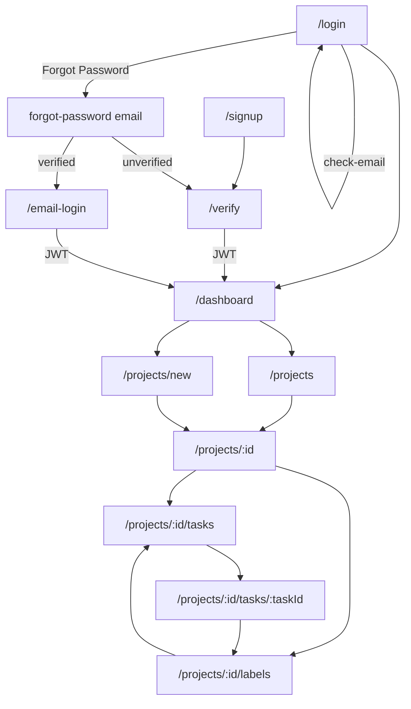

# TaskHive frontend requirements (current implementation)

This document is the **frontend source of truth** for what the React app actually does today.

It is derived from [`docs/PROJECT_REQUIREMENTS.md`](../../docs/PROJECT_REQUIREMENTS.md) (product contract) and [`backend/doc/backend_requirements.md`](../../backend/doc/backend_requirements.md) (API behavior). Where the product doc still labels UI areas as “Planned,” **this file is authoritative** for the current SPA.

**Verdict:** The frontend implements **all in-scope backend APIs** exposed today: auth, users, projects, members, tasks (list with filters, detail, CRUD), labels (catalog CRUD + task tagging), comments (CRUD), and dashboard stats. Out-of-scope backend features (nested replies, attachments, notifications, etc.) have **no UI**.

**Branch:** `feat/tasks-labels-comments` (Git branch names cannot contain commas; this is the implementation branch for tasks, labels, and comments).

---

## Relationship to other docs

| Topic | Product doc | Backend | Frontend today |
|---|---|---|---|
| Signup, verify email (auto-login), login, check-email, forgot-password magic links | Implemented | Implemented | **Implemented** |
| Dashboard | Implemented | Stats API added | **Implemented** (live stats) |
| Projects CRUD + members | Implemented | Implemented | **Implemented** |
| Tasks list, create, update, delete | Implemented | Implemented | **Implemented** |
| Task detail (get-one) | Planned in product doc | Implemented | **Implemented** |
| Task filters (`assignee_id`, `reporter_id`, `label_id`, sort) | Planned in product doc | Implemented | **Implemented** |
| Labels catalog + task tagging | Planned in product doc | Implemented | **Implemented** |
| Comments on tasks | Planned in product doc | Implemented | **Implemented** |
| Nested replies, attachments, activity log, notifications | Out of scope | Not implemented | **No UI** |

---

## Tech stack

| Layer | Choice |
|---|---|
| Runtime | React 19 + Vite 8 |
| Routing | React Router 7 |
| HTTP | Axios (`src/api/client.js`) |
| Forms | React Hook Form + Zod resolvers |
| Styling | Tailwind CSS 4 + shadcn-style UI primitives (`Button`, `Input`) |
| State | Redux Toolkit + redux-persist for auth (`accessToken` + `user`); **TanStack Query** for server state (projects, tasks, labels, comments, dashboard) |

Path alias: `@/` → `src/` (see `vite.config.js`).

---

## Configuration

| Variable | Purpose |
|---|---|
| `VITE_API_URL` | Axios base URL, e.g. `http://localhost:8000/api` |

The axios client uses paths **relative to that base** (`/projects`, `/auth/login`, etc.), so `VITE_API_URL` must include the `/api` prefix.

Local dev (Docker Compose): frontend `:5174`, backend `:8000`. CORS on the backend must include the frontend origin.

---

## Application architecture

### Entry and providers

- `src/main.jsx` mounts `App` inside Redux `Provider`, `PersistGate`, and TanStack `QueryClientProvider` (`src/api/queryClient.js`).
- `App.jsx` wraps routes in `BrowserRouter` and mounts `AuthSessionBootstrap`.

### Server state (TanStack Query)

| Piece | Role |
|---|---|
| `api/queryClient.js` | Shared `QueryClient` (30s staleTime, 1 retry, no refetch on focus) |
| `api/queryKeys.js` | Query key factory; `authQueryKey(base, userId)` scopes cache entries per user |
| `api/queries.js` | Axios fetch helpers used by `queryFn` |

Pages use `useQuery` for reads and `useMutation` for writes, with `invalidateQueries` / `setQueryData` after mutations. Kanban status changes use optimistic updates via `onMutate` / rollback on error.

Auth JWT + user remain in Redux (not React Query).

### Authentication

**Storage:** JWT `accessToken` and `user` live in **Redux** (`src/store/authSlice.js`) and are **persisted** with `redux-persist` (localStorage key `persist:auth`). Session survives page refresh without requiring a login again.

**Fast path:** Protected routes use the rehydrated token/user immediately. They do **not** block on a network `/users/me` call.

**Background revalidation:** `AuthSessionBootstrap` quietly calls `GET /users/me` after rehydrate. On success it refreshes `user`. On **401** the axios interceptor clears credentials and redirects; on transient/network/5xx errors the persisted session is kept unchanged.

**Login (`hooks/useAuth.js`):** `POST /auth/login` → `completeLogin(accessToken)` → `setCredentials` with token → `resetQueryCache()` → `GET /users/me` → `setCredentials` with token + user (then persisted). The same `completeLogin` path is used after verify and magic email-login.

**Logout:** `resetQueryCache()` (cancel in-flight fetches + clear cache) then `clearCredentials()` in Redux (persist writes the cleared session), then navigate to `/login`. Query keys are also scoped by user id so a new session never reads another user's cache entries. No server revoke endpoint (matches backend).

**Signup:** `POST /auth/signup`; user is prompted to verify email (no auto-login on signup itself).

**Interactive email check (Login):** on blur and debounced change (valid email shape), `POST /auth/check-email`. Unknown → “Email does not exist” (submit disabled); exists + unverified → verify prompt; exists + verified → clear status errors.

**Forgot Password (Login only):** `POST /auth/forgot-password` with the entered email. Unverified → verification email; verified → magic sign-in email. No Change Password link on auth pages.

**Email verification:** `/verify?token=…` calls `GET /auth/verify?token=…`, which returns a JWT; `completeLogin` then navigates to `/dashboard` (not `/login`).

**Magic email login:** `/email-login?token=…` calls `GET /auth/email-login?token=…` → `completeLogin` → `/dashboard`.

**Theme:** Still uses a separate `localStorage` key `theme` (unrelated to auth).

### Route protection

`ProtectedRoute.jsx` gates authenticated routes:
- Until Redux Persist rehydrates → render nothing (avoids login flash on refresh)
- Not authenticated (`!accessToken`) → redirect to `/login`
- Authenticated → render nested `<Outlet />`

### HTTP client (`src/api/client.js`)

- Injects `Authorization: Bearer <token>` from `store.getState().auth.accessToken`.
- On **401** for non-auth endpoints: dispatches `clearCredentials()` and redirects to `/login`.
- Auth endpoints (`/auth/login`, `/auth/signup`, `/auth/verify`, `/auth/resend-verification`, `/auth/check-email`, `/auth/forgot-password`, `/auth/email-login`) are excluded from auto-redirect so auth errors display inline.

### Error handling

`getApiError(error, fallback)` in `src/lib/utils.js` normalizes FastAPI errors:
- String `detail` → shown as-is
- Array `detail` (422 validation) → joined messages
- Otherwise → fallback string

Pages display errors through `ErrorBanner`.

### Date formatting

- `formatDate(value)` — full locale datetime (task detail, comments)
- `formatDateShort(value)` — date only (lists, project cards)
- `toDatetimeLocalValue(isoString)` — ISO → local `YYYY-MM-DDTHH:mm` for `<input type="datetime-local">` pre-fill
- `datetimeLocalToIso(localString)` — datetime-local input value → ISO UTC for API submit

Datetime-local forms use these helpers so pre-fill and submit both use local wall clock (avoids UTC slice drift on each edit cycle).

---

## Routes and pages

| Path | Page | Auth | Description |
|---|---|---|---|
| `/` | redirect | — | Redirects to `/signup` |
| `/signup` | `SignupPage` | Public | Register new account (AuthLayout; no Forgot/Change links) |
| `/login` | `LoginPage` | Public | Login; interactive email check; Forgot Password? magic link; unverified + resend |
| `/verify` | `VerifyEmailPage` | Public | Email verification from link → JWT → dashboard |
| `/email-login` | `EmailLoginPage` | Public | Magic sign-in from forgot-password link → JWT → dashboard |
| `/dashboard` | `DashboardPage` | Protected | Welcome, theme toggle, live task stats, quick actions |
| `/projects` | `ProjectsPage` | Protected | Grid of user’s projects |
| `/projects/new` | `CreateProjectPage` | Protected | Create project form |
| `/projects/:id` | `ProjectDetailPage` | Protected | Project info, edit/delete (owner), members, invite |
| `/projects/:id/tasks` | `ProjectTasksPage` | Protected | Task list, filters, inline create, delete |
| `/projects/:id/tasks/:taskId` | `TaskDetailPage` | Protected | Task detail, edit, labels, comments |
| `/projects/:id/labels` | `ProjectLabelsPage` | Protected | Project label catalog CRUD |

`TaskDetailPage` is mounted via `TaskDetailRoute` with `key={taskId}` so navigating between tasks remounts the page and resets loading state.

---

## Page behavior (detailed)

### Dashboard (`DashboardPage.jsx`)

**API:** `GET /dashboard/stats`

**UI:**
- Welcome banner with current user name
- Three stat cards: `total`, `in_progress`, `completed`
- Dark/light theme toggle (persisted in `localStorage` key `theme`; toggles `dark` class on `<html>`)
- Quick actions: New Project, View Projects
- Logout

### Projects list (`ProjectsPage.jsx`)

**API:** `GET /projects`

**UI:** Card grid; click navigates to project detail. Shows name, description, deadline, created date. Empty state with CTA.

### Create project (`CreateProjectPage.jsx`)

**API:** `POST /projects`

**Validation:** `projectSchema` — name required (max 255), description optional (max 255), deadline optional.

**Behavior:** On success, navigate to `/projects/:id`. Deadline sent as ISO string or `null`.

### Project detail (`ProjectDetailPage.jsx`)

**APIs:**
- `GET /projects/:id`
- `PATCH /projects/:id` (owner only)
- `DELETE /projects/:id` (owner only)
- `GET /users/` (owner only, for invite dropdown)
- `POST /projects/:id/members` (owner only)
- `DELETE /projects/:id/members/:userId` (owner only)

**UI:**
- Header links: **Labels**, **Tasks**
- View/edit project fields (owner can edit/delete)
- Member list with role badges; owner can remove non-owner members
- Invite member: select from registered users not already on project

**Permissions:** `isOwner = user.id === project.owner_id`. Non-owners see read-only project info and member list without invite/remove/edit/delete.

### Project tasks (`ProjectTasksPage.jsx`)

**APIs:**
- `GET /projects/:id` (project name + members for assignee display)
- `GET /projects/:id/tasks` with query params
- `GET /projects/:id/labels` (label filter dropdown)
- `POST /projects/:id/tasks`
- `DELETE /projects/:id/tasks/:taskId`

**Filters (query params):**

| UI control | Param | Values |
|---|---|---|
| Status | `status` | `TODO`, `IN_PROGRESS`, `DONE`, or empty (all) |
| Priority | `priority` | `LOW`, `MEDIUM`, `HIGH`, or empty |
| Assignee | `assignee_id` | member user id or empty |
| Reporter | `reporter_id` | member user id or empty |
| Label | `label_id` | label id or empty |
| Sort | `sort` | `due_date`, `created_at`, `priority`, `status`, `title`, or empty (newest default) |

**Create task form:** title, description, status, priority, due date, assignee (project members). Validation via `taskSchema`. Reporter is set by backend to current user.

**Views:**
- **Board (default):** Kanban columns `TODO` / `IN_PROGRESS` / `DONE`. Drag a card onto another column to `PUT` `{ status }` (optimistic UI; reverts on error). Status filter is ignored so all columns stay populated. Click a card title to open detail.
- **List:** Filterable/sortable list with Open / Delete actions (previous default).

**List item:** title, status/priority badges, description excerpt, due date, assignee name. Actions: Open (detail), Delete (confirm).

### Task detail (`TaskDetailPage.jsx`)

**APIs:**
- `GET /projects/:id/tasks/:taskId` → `TaskDetailOut` including `labels[]`
- `GET /projects/:id` (members for assignee/reporter names, owner check)
- `GET /projects/:id/labels` (available labels for tagging)
- `GET /projects/:id/tasks/:taskId/comments`
- `PATCH /projects/:id/tasks/:taskId`
- `DELETE /projects/:id/tasks/:taskId`
- `POST /projects/:id/tasks/:taskId/labels` body `{ label_id }`
- `DELETE /projects/:id/tasks/:taskId/labels/:labelId`
- `POST /projects/:id/tasks/:taskId/comments` body `{ body }`
- `PATCH /projects/:id/tasks/:taskId/comments/:commentId`
- `DELETE /projects/:id/tasks/:taskId/comments/:commentId`

**Task view:** title, status/priority badges, description, due date, assignee, reporter, created/updated timestamps.

**Edit mode:** same fields as create; `PUT` on save.

**Labels section:**
- Shows attached labels as colored chips (`LabelChip`)
- Click chip → untag (DELETE)
- Dropdown of untagged labels + Tag button
- Link to label catalog if project has no labels

**Comments section:**
- Post new comment (any project member)
- List comments with author name and timestamp
- Edit: author only
- Delete: author **or** project owner
- Inline edit form per comment

### Project labels (`ProjectLabelsPage.jsx`)

**APIs:**
- `GET /projects/:id`
- `GET /projects/:id/labels`
- `POST /projects/:id/labels` — `{ name, color? }`
- `PATCH /projects/:id/labels/:labelId` — `{ name, color }`
- `DELETE /projects/:id/labels/:labelId`

**UI:** Create form (name + color picker, default `#6B7280`). List with inline edit (name + color) and delete (confirm). Labels displayed via `LabelChip`.

**Validation:** `labelSchema` — name required (max 50), color optional hex `#RRGGBB`.

### Auth pages

Shared shell: `AuthLayout` — warm stone → muted olive full-viewport gradient, centered elevated card, olive-charcoal CTAs.

**Signup (`SignupPage.jsx`):** Name / Email / Password with required `*` labels; password rule hint (≥8 chars, ≥1 letter, ≥1 digit); no Forgot / Change links → signup → “check your email” → link to Login only.

**Login (`LoginPage.jsx`):** Email / Password with required `*`. Interactive `POST /auth/check-email` on blur/debounce. Small-font **Forgot Password?** only (prefills entered email via `POST /auth/forgot-password`). On 403 unverified, shows verify prompt + optional resend.

**Verify email (`VerifyEmailPage.jsx`):** reads `token` query param, calls verify, `completeLogin`, navigates to `/dashboard`.

**Email login (`EmailLoginPage.jsx`):** reads `token`, calls email-login, `completeLogin`, navigates to `/dashboard`.

---

## Shared components

| Component | File | Purpose |
|---|---|---|
| `ProtectedRoute` | `components/ProtectedRoute.jsx` | Auth gate for nested routes |
| `AuthLayout` | `components/AuthLayout.jsx` | Shared auth page shell (gradient + card) |
| `ErrorBanner` | `components/ErrorBanner.jsx` | Red alert for API/validation errors |
| `LabelChip` | `components/LabelChip.jsx` | Pill showing label name on colored background |
| `TaskStatusBadge` | `components/TaskBadges.jsx` | Colored badge for TODO / IN_PROGRESS / DONE |
| `TaskPriorityBadge` | `components/TaskBadges.jsx` | Colored badge for LOW / MEDIUM / HIGH |
| `Button` | `components/ui/button.jsx` | shadcn-style button (variants: default, outline, destructive; sizes include `sm`) |
| `Input` | `components/ui/input.jsx` | shadcn-style input (used on login/signup) |

---

## Validation schemas

| Schema | File | Used by |
|---|---|---|
| `projectSchema`, `inviteSchema` | `schemas/projectSchema.js` | Create/edit project, invite member |
| `taskSchema` | `schemas/taskSchema.js` | Create/edit task |
| `labelSchema` | `schemas/labelSchema.js` | Create label |
| `commentSchema` | `schemas/commentSchema.js` | Post/edit comment |
| Inline Zod schemas | `LoginPage`, `SignupPage` | Auth forms |

`taskUpdateSchema` and `labelUpdateSchema` are exported for partial updates but pages use full schemas in edit forms today.

---

## API coverage matrix

Every **implemented** backend endpoint (per `backend/doc/backend_requirements.md`) is either called by the frontend or intentionally client-only:

| Method | Path | Frontend usage |
|---|---|---|
| POST | `/auth/signup` | SignupPage |
| GET | `/auth/verify` | VerifyEmailPage → JWT → dashboard |
| POST | `/auth/resend-verification` | LoginPage |
| POST | `/auth/check-email` | LoginPage (interactive lookup) |
| POST | `/auth/forgot-password` | LoginPage (Forgot Password?) |
| GET | `/auth/email-login` | EmailLoginPage → JWT → dashboard |
| POST | `/auth/login` | `useAuth().login` |
| GET | `/users/me` | `completeLogin` / AuthSessionBootstrap |
| GET | `/users/` | ProjectDetailPage invite dropdown |
| POST | `/projects` | CreateProjectPage |
| GET | `/projects` | ProjectsPage |
| GET | `/projects/{id}` | ProjectDetailPage, ProjectTasksPage, TaskDetailPage, ProjectLabelsPage |
| PATCH | `/projects/{id}` | ProjectDetailPage (owner) |
| DELETE | `/projects/{id}` | ProjectDetailPage (owner) |
| POST | `/projects/{id}/members` | ProjectDetailPage (owner) |
| DELETE | `/projects/{id}/members/{user_id}` | ProjectDetailPage (owner) |
| POST | `/projects/{id}/tasks` | ProjectTasksPage |
| GET | `/projects/{id}/tasks` | ProjectTasksPage (with filters) |
| GET | `/projects/{id}/tasks/{task_id}` | TaskDetailPage |
| PATCH | `/projects/{id}/tasks/{task_id}` | TaskDetailPage, ProjectTasksPage (status) |
| DELETE | `/projects/{id}/tasks/{task_id}` | ProjectTasksPage, TaskDetailPage |
| POST | `/projects/{id}/labels` | ProjectLabelsPage |
| GET | `/projects/{id}/labels` | ProjectLabelsPage, ProjectTasksPage, TaskDetailPage |
| PATCH | `/projects/{id}/labels/{label_id}` | ProjectLabelsPage |
| DELETE | `/projects/{id}/labels/{label_id}` | ProjectLabelsPage |
| POST | `/projects/{id}/tasks/{task_id}/labels` | TaskDetailPage |
| DELETE | `/projects/{id}/tasks/{task_id}/labels/{label_id}` | TaskDetailPage |
| GET | `/projects/{id}/tasks/{task_id}/comments` | TaskDetailPage |
| POST | `/projects/{id}/tasks/{task_id}/comments` | TaskDetailPage |
| PATCH | `/projects/{id}/tasks/{task_id}/comments/{comment_id}` | TaskDetailPage |
| DELETE | `/projects/{id}/tasks/{task_id}/comments/{comment_id}` | TaskDetailPage |
| GET | `/dashboard/stats` | DashboardPage |
| GET | `/health` | **Not called** (infra health check only) |

**Logout** is client-only (clear token); no API.

---

## Navigation flow



---

## Permissions reflected in UI

The backend enforces membership and ownership; the frontend mirrors rules where practical:

| Action | UI gate |
|---|---|
| Edit/delete project | Owner only (`user.id === project.owner_id`) |
| Invite/remove members | Owner only |
| Create/edit/delete tasks | Any member (backend requires membership) |
| Manage label catalog | Any member |
| Tag/untag labels on tasks | Any member |
| Post comment | Any member |
| Edit comment | Author only |
| Delete comment | Author or project owner |

Non-members never reach project routes with valid data; backend returns 404 for hidden projects.

---

## Styling and UX conventions

- **Layout:** Full-width pages with max-width containers (`max-w-4xl` … `max-w-7xl`), consistent header bars with back/actions.
- **Auth shell:** Signup / login / verify / email-login use `AuthLayout` with stone→olive gradient (`#EDE6DC` → `#C9D0BE`) and olive-charcoal CTAs (not the global purple/cream clichés).
- **Theme:** Light default; dark mode via `dark:` Tailwind classes and `localStorage.theme`.
- **Cards:** Rounded borders, gray-50 / gray-900 backgrounds for content sections (app pages; auth uses `AuthLayout` card).
- **Destructive actions:** Confirm dialogs (`window.confirm`) before delete (project, task, label, comment, member).
- **Loading:** Page-level “Loading…” text; task list uses separate initial load vs. filter refresh states.

---

## Source file map

```
frontend/src/
├── api/client.js              # Axios instance + JWT from Redux + 401 logout
├── api/queryClient.js         # TanStack QueryClient defaults
├── api/queryKeys.js           # Query key factory
├── api/queries.js             # Shared fetch helpers
├── App.jsx                    # Routes + AuthSessionBootstrap
├── store/
│   ├── index.js               # configureStore + redux-persist
│   └── authSlice.js           # accessToken + user
├── hooks/useAuth.js           # login / logout / signup / checkEmail / forgotPassword / completeLogin
├── components/
│   ├── AuthLayout.jsx            # auth gradient shell
│   ├── AuthSessionBootstrap.jsx  # background /users/me after rehydrate
│   ├── ProtectedRoute.jsx
│   ├── ErrorBanner.jsx
│   ├── LabelChip.jsx
│   ├── TaskBadges.jsx
│   ├── TaskKanbanBoard.jsx
│   └── ui/button.jsx, input.jsx
├── lib/utils.js               # cn, getApiError, formatDate*, datetime-local helpers
├── schemas/
│   ├── projectSchema.js
│   ├── taskSchema.js
│   ├── labelSchema.js
│   └── commentSchema.js
└── pages/
    ├── SignupPage.jsx
    ├── LoginPage.jsx
    ├── VerifyEmailPage.jsx
    ├── EmailLoginPage.jsx
    ├── DashboardPage.jsx
    ├── ProjectsPage.jsx
    ├── CreateProjectPage.jsx
    ├── ProjectDetailPage.jsx
    ├── ProjectTasksPage.jsx
    ├── TaskDetailPage.jsx
    └── ProjectLabelsPage.jsx
```

---

## Build and quality

```bash
cd frontend
npm run dev      # Vite dev server
npm run build    # Production bundle → dist/
npm run lint     # ESLint (flat config, react-hooks + react-refresh)
```

Both `npm run build` and `npm run lint` pass on the current implementation.

---

## Known limitations / not implemented

These match backend out-of-scope items; there is **no frontend work** for them:

- Nested comment threads / replies
- File attachments on tasks or comments
- Activity feed or audit log UI
- In-app notifications
- Change Password / public reset-password forms (Forgot Password uses magic email links; Change Password planned in-app later)
- Pagination (lists load full collections)
- Dedicated `/users/me` profile settings page
- Role management beyond owner vs. member
- Within-column task order persistence (board DnD only changes status)

---

## Future-friendly notes

- **Task list filters** re-fetch on every filter change; debouncing is not implemented (acceptable for current scale).
- **Product doc sync:** [`docs/PROJECT_REQUIREMENTS.md`](../../docs/PROJECT_REQUIREMENTS.md) may still say “Planned” for labels/comments/dashboard; backend and frontend docs supersede those labels for implementation status.
